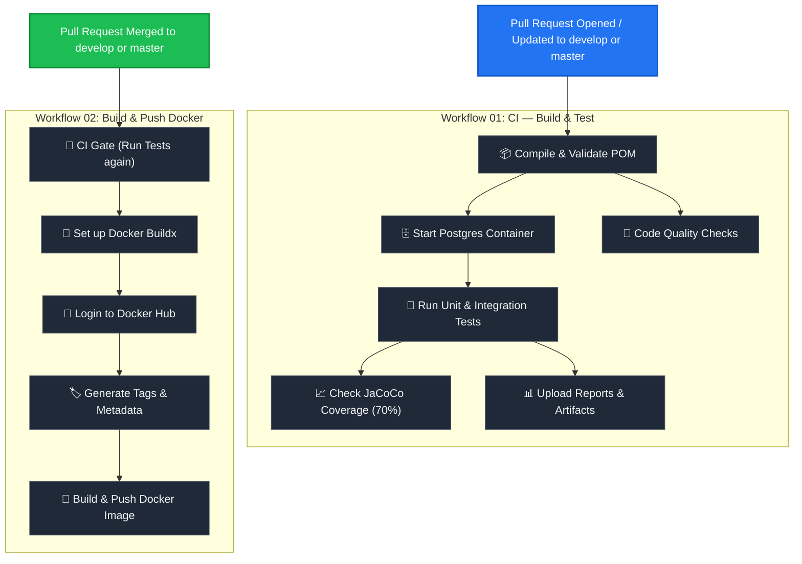

# GitHub Actions CI/CD Pipeline Reference Guide

This guide describes a clean, production-ready CI/CD pipeline template for a Spring Boot (Java/Maven) application with a PostgreSQL database and Docker Hub containerization. You can copy this documentation and the associated workflows to other projects to implement the same workflow.

---

## 📂 Pipeline Structure & File Locations

All workflow configuration files must be stored in the `.github/workflows/` directory at the root of your project:

```text
your-project-root/
├── .github/
│   └── workflows/
│       ├── 01-ci-test.yml                # CI: Build, Test & Quality Gates (Runs on Pull Requests)
│       └── 02-build-and-push-docker.yml  # CD: Build & Push Docker Image (Runs on Merge / Manual)
└── .github/workflows-disabled/
    ├── 03-deploy-test.yml                # [Optional] Staging Deployment (Disabled by default)
    └── 04-deploy-prod.yml                # [Optional] Production Deployment (Disabled by default)
```

---

## 🔄 The Workflow Pipeline

The pipeline follows a GitFlow-friendly branching strategy where direct pushes to protected branches are discouraged. Instead, changes are validated via Pull Requests (PRs), and Docker images are built only when those PRs are merged.



---

## 🛠️ Required GitHub Secrets

To make these workflows run successfully, you need to add the following secrets under **Settings ➔ Secrets and variables ➔ Actions ➔ Repository secrets**:

### Database Secrets (Used for Integration Tests)
| Secret Name | Description | Example Value |
| :--- | :--- | :--- |
| `TEST_DB_NAME` | Database name for the Postgres service container | `myapp_test_db` |
| `TEST_DB_USER` | Username for the Postgres service container | `test_user` |
| `TEST_DB_PASSWORD` | Strong password for the Postgres service container | `db_pass_1234!` |

### Docker Hub Registry Secrets
| Secret Name | Description | Example Value |
| :--- | :--- | :--- |
| `DOCKERHUB_USERNAME` | Your Docker Hub account username | `dockerhub_user` |
| `DOCKERHUB_TOKEN` | Docker Hub Personal Access Token (PAT) | `dckr_pat_xxxxxxxxxx` |
| `DOCKERHUB_REPO` | Docker Repository namespace and name | `dockerhub_user/myapp` |

> [!TIP]
> **Docker Personal Access Token**: Do not use your primary Docker Hub account password. Generate a secure read/write token under **Docker Hub Account Settings ➔ Security ➔ New Access Token**.

---

## 📜 Detailed Workflow Explanations

### 1️⃣ Workflow 01: CI — Build & Test (`01-ci-test.yml`)

#### Trigger Conditions
* Runs automatically whenever a Pull Request is **opened, updated, or synchronized** against the `master` or `develop` branches.
* Restricts execution to changes made in the code directory (`cicd/**`) or the workflow itself, saving GitHub Action runner minutes.

#### Key Jobs & Steps
* **Compile Job**: 
  * Checks out code and provisions a Java JDK.
  * Validates the Maven Project Object Model (`pom.xml`).
  * Compiles the source files to ensure no syntax errors.
* **Test Job**: 
  * Spins up a temporary **PostgreSQL 16 Service Container** sidecar.
  * Injects database credentials as environment variables.
  * Executes Maven tests using active profile `test`.
  * Runs a **JaCoCo coverage rule** (defaults to requiring 70% line coverage).
  * Uploads test summaries and HTML coverage reports to GitHub Actions artifacts for inspection.
* **Code Quality Job**:
  * Scans for dependency updates and checks for potential library upgrades.

---

### 2️⃣ Workflow 02: Build & Push Docker Image (`02-build-and-push-docker.yml`)

#### Trigger Conditions
* Runs when a Pull Request targetting `master` or `develop` is **closed and merged** (`types: [closed]`).
* Runs when manually triggered using **`workflow_dispatch`** from the GitHub Actions UI.
* Executes only if changes occurred in the code directory (`cicd/**`), `Dockerfile`, or the workflow file.

#### Key Jobs & Steps
* **CI Gate Job**:
  * A safety check that runs all tests and packages the application compile artifact (`.jar`).
  * Only runs if the PR was actually merged (`github.event.pull_request.merged == true`) or if triggered manually.
* **Docker Build & Push Job**:
  * Downloads the packaged application artifact from the previous step.
  * Configures **Docker Buildx** (enabling multi-platform builds and advanced cache mechanisms).
  * Logins securely to Docker Hub registry.
  * Generates structured tags using `docker/metadata-action`:
    * Tagged with the short Git commit SHA for exact traceability and production references.
    * Tagged with `latest` *only* when merging directly to the `master` branch.
  * Builds the container image using the project `Dockerfile` and pushes it to Docker Hub.
  * Leverages GitHub Actions caching (`type=gha`) for fast, subsequent builds.

---

## 🚀 How to Port This to a New Repository

1. **Replicate Structure**: Create the `.github/workflows` folder in the root of your new project.
2. **Copy Files**: Place both `01-ci-test.yml` and `02-build-and-push-docker.yml` inside.
3. **Configure Working Directory**:
   If your application source code is not in a subfolder like `cicd` (e.g., it is in the root directory), update the `WORKING_DIR` env variable in both files:
   ```yaml
   env:
     WORKING_DIR: .   # Change from ./cicd to .
   ```
4. **Setup Secrets**: Add the required database and Docker Hub secrets to your new GitHub repository.
5. **Set up Dockerfile**: Ensure your project contains a standard `Dockerfile` in the path specified by the build workflow.
